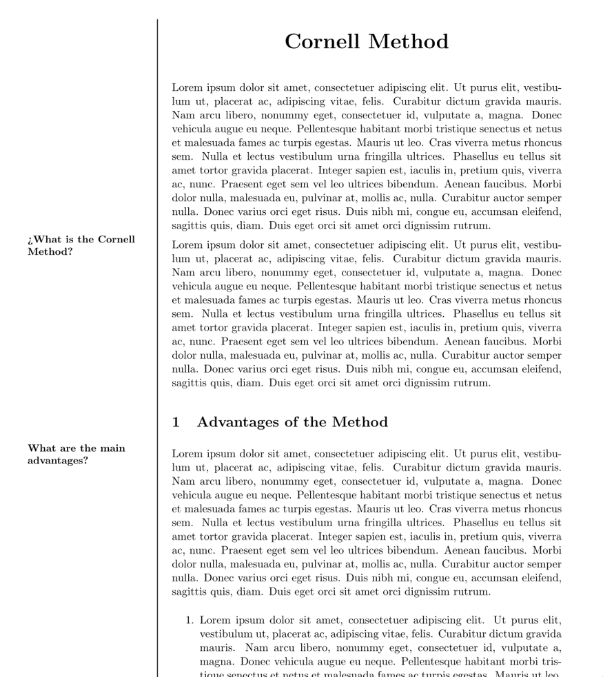

# minimalistic-cornell
A minimalistic template based on the Cornell Note Taking Technique written in LaTex

## Why the Cornell Note Taking Technique?
The Cornell Note-Taking Technique was created with the simple purpose
of improving the quality and quantity of your study sessions. Since I
couldn’t find any LaTeX template that met my needs while remaining
minimalistic, I decided to create this simple template.

## How does it work? 
All your LaTex commands and paragraphs will be automatically located 
inside de "Notes" section (right-side column). 
By simply invoking the command `\topic{}` you will be adding a new 
topic which will be located in the "Topics" section (left-side column).

## Example

```latex
\documentclass{article}
\begin{document}
\cornelltitle{Cornell Method}
\lipsum[1]
\topic{¿What is the Cornell Method?} %New Topic 
\lipsum[1]
\section{Advantages of the Method}
\topic{What are the main advantages?} %New Topic
\lipsum[1]
\begin{enumerate}
\item \lipsum[1]
\item \lipsum[1]
\item \lipsum[1]
\item \lipsum[1]
\end{enumerate}
\end{document}
```
### Your LaTex PDF file will look like this: 


